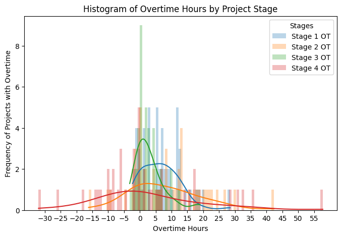
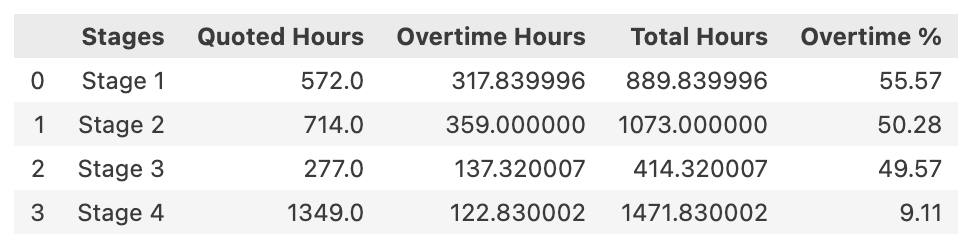

# Project Quotes

### Overview
This project aims to work with a dataset of historical projects collected from an architectural firm. The goal is to identify patterns and provide insights, in order to improve the accuracy of the quotations, subsequently minimising unplanned overtime works for future projects.

The project was inspired by my first-hand experience as an architect, where I observed a recurring challenge with project management and quoting accuracy in the industry. It is no doubt that accurate project quoting is crucial for both client satisfaction, and efficient resource and time management. I saw this opportunity to provide valuable insights using data-driven methods, in order to understand if there are any patterns and discrepancies behind the numbers. I hope this project can help the architectural firm to streamline their quoting process, ensuring more precise estimates and better time and resource planning going forward with future projects.

### Dataset Overview
The dataset focuses on hours quoted by directors of the firm, and overtime hours worked for that project. The projects (observations) are mostly residential renovation or home extension projects across London. The hours are recorded against different stages set out by RIBA(Royal Institute of British Architects).

For data protection, the site address and director entries have been modified and anonymised in the notebooks.

### Data Dictionary
| Variable          | Definition                                           |
|-------------------|------------------------------------------------------|
| Project No        | Project number on file                               |
| Project Address   | Project address                                      |
| Postcode          | Project postcode                                     |
| Director          | Director in charge                                   |
| Stage 1           | Hours quoted for Stage 1 (Preparation and Briefing)  |
| Stage 2           | Hours quoted for Stage 2 (Concept Design)            |
| Stage 3           | Hours quoted for Stage 3 (Spatial Coordination)      |
| Stage 4           | Hours quoted for Stage 4 (Technical Design)          |
| Stage 1 OT        | Overtime hours worked during Stage 1                 |
| Stage 2 OT        | Overtime hours worked during Stage 2                 |
| Stage 3 OT	    | Overtime hours worked during Stage 3                 |
| Stage 4 OT	    | Overtime hours worked during Stage 4                 |
| Current Est Value | Current estimated property value as of June 2024     |

**Variable Notes**
The main body of the dataset includes numerical entries of hours spent on different RIBA stages 1 through 4. For further reading, refer to: [RIBA Stages](https://www.architecture.com/knowledge-and-resources/resources-landing-page/riba-plan-of-work)

Current estimated property value resource: [Property Checker](https://propertychecker.co.uk/)

# Summary of Findings from Exploratory Data Analysis (EDA)
### 1. Director Impact
1.1 Director A tends to quote fewer total hours but results in more overtime.

1.2 Director A's projects experience timesheet recording issues, demonstrated by the missing values.

### 2. Workload by Stage

### 3. Project Property Value

### Further Analysis / Improvements
### Future Recommendations