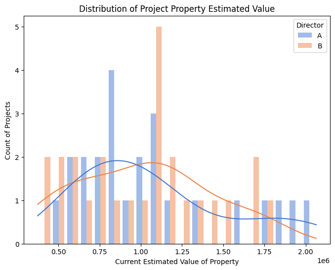

# Project Quotes

### Overview
This project aims to work with a dataset of historical projects collected from an architectural firm. The goal is to identify patterns and provide insights, in order to improve the accuracy of the quotations, subsequently minimising unplanned overtime works for future projects.

The project was inspired by my first-hand experience as an architect, where I observed a recurring challenge with project management and quoting accuracy in the industry. It is no doubt that accurate project quoting is crucial for both client satisfaction, and efficient resource and time management. I saw this opportunity to provide valuable insights using data-driven methods, in order to understand if there are any patterns and discrepancies behind the numbers. I hope this project can help the architectural firm to streamline their quoting process, ensuring more precise estimates and better time and resource planning going forward with future projects.

### Dataset Description
The dataset focuses on hours quoted by directors of the firm, and overtime hours worked for that project. The projects (observations) are mostly residential renovation or home extension projects across London. The hours are recorded against different stages set out by RIBA(Royal Institute of British Architects).

For data protection, the site address and director entries have been modified and anonymised in the notebooks.

**Data Dictionary**

| Variable          | Definition                                           |
|-------------------|------------------------------------------------------|
| Project No        | Project number on file                               |
| Project Address   | Project address                                      |
| Postcode          | Project postcode                                     |
| Director          | Director in charge                                   |
| Stage 1           | Hours quoted for Stage 1 (Preparation and Briefing)  |
| Stage 2           | Hours quoted for Stage 2 (Concept Design)            |
| Stage 3           | Hours quoted for Stage 3 (Spatial Coordination)      |
| Stage 4           | Hours quoted for Stage 4 (Technical Design)          |
| Stage 1 OT        | Overtime hours worked during Stage 1                 |
| Stage 2 OT        | Overtime hours worked during Stage 2                 |
| Stage 3 OT	    | Overtime hours worked during Stage 3                 |
| Stage 4 OT	    | Overtime hours worked during Stage 4                 |
| Current Est Value | Current estimated property value as of June 2024     |

**Variable Notes**

The main body of the dataset includes numerical entries of hours spent on different RIBA stages 1 through 4. For further reading, refer to: [RIBA Stages](https://www.architecture.com/knowledge-and-resources/resources-landing-page/riba-plan-of-work)

Current estimated property value resource: [Property Checker](https://propertychecker.co.uk/)

## Summary of Findings from Exploratory Data Analysis (EDA)
### 1. Director Impact
It was discovered that Director B tends to quote fewer total hours but results in more overtime. From the EDA, it was clear that Directors A and B tend to take on fairly similar valued projects. However, Director A seems to be more realistic when quoting, resulting in overall less overtime than Director B's projects. Despite this, both directors still face significant overtime issues on projects.

It was noted that Director A's projects experience timesheet recording issues, demonstrated by the missing values. The missing values highlighted are found in the overtime columns, which are attributed to human factors, such as poor timesheet recording practices by the project team. Out of 50 projects, there are 10 projects with such issues, with 9 of them being Director A's projects.

### 2. Workload by Stage
It was confirmed that the stage makes a difference, as each stage requires a different amount of workload. It was discovered that apart from stage 4, the other 3 stages experienced approximately 50% more hours worked as overtime by the quoted hours proportion.

|Stages	|Total Quoted Hours	|Total Overtime Hours |Total Hours Worked |Overtime % |Average Overtime per Project|
|-------|-------------------|---------------------|-------------------|-----------|----------------------------|
|1      |572  	            |317.84               |889.84             |55.57%     |6.35 hrs                    |
|2      |714	              |359.00               |1073.00            |50.28%     |7.18 hrs                    |
|3      |277                |137.32            	  |414.32          	  |49.57%     |2.75 hrs                    |
|4      |1349               |122.83            	  |1471.83          	|9.11%      |2.46 hrs                    |

### 3. Project Property Value
By examining the distribution of project property values by the directors, it was confirmed that both directors handle projects within a similar range. This suggests that, given similarly sized projects, Director B is likely to under-quote hours.

The project property value did not show a strong correlation with any other features. However, since it shows a slight positive correlation with the target (predicted total hours), it was included as a feature in the model training because it serves as an independent variable.

## Further Recommendations / Improvements
### Data Quality:
Addressing missing data, especially in the overtime columns, can provide a clearer picture of workload distribution. It is recommended that Director A ensures better timesheet recording practices on their projects to improve data accuracy.

### Data Quantity:
A larger dataset will help improve the model's performance, as 50 projects is a fairly small amount. More data will provide a clearer picture of workload distribution without being heavily influenced by outliers.

### Feature Engineering:
As the project property value didn't seem to have a strong correlation with the predicted overtime hours, perhaps a different feature would be more suitable, such as project brief/complexity or the client's budget (as this informs the extent of the renovation project). These features might be more informative than the project property value because a client could have a highly valued property but only be looking to carry out a minor project, resulting in much lower hours needed for the work.

Therefore, additional features such as project brief/complexity, project team information/size, and other factors that might influence the overtime could be identified and added to the model. This, however, would require further research and domain knowledge in the data collection stage.
